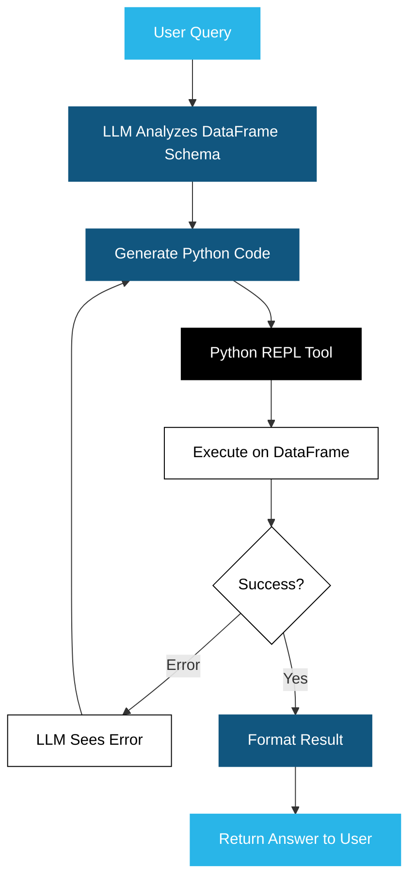

# Data Analysis Agent - for CSV data

## Architecture

## Overview

This project implements an intelligent data analysis system that:

1. **Accepts User Queries** - Users provide natural language questions about their data
2. **Analyzes DataFrame Schema** - The LLM understands the structure and content of the data
3. **Generates Python Code** - Creates executable Python code to answer the query
4. **Executes Code** - Runs the generated code in a Python REPL environment
5. **Handles Errors** - If execution fails, the LLM sees the error and iterates on the solution
6. **Formats Results** - Presents the answer in a user-friendly format

## Dependencies

See `requirements.txt` for all project dependencies, including:
- LangChain and LangGraph for LLM orchestration
- Streamlit for the web interface
- Pandas and NumPy for data manipulation
- Google Generative AI for LLM capabilities